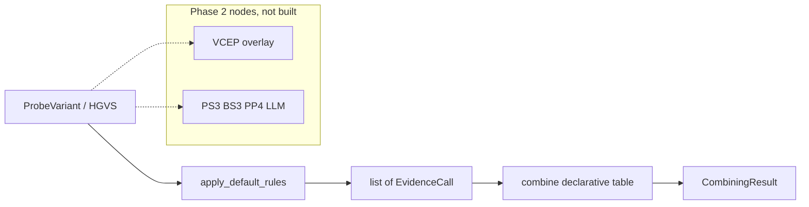

# acmg-triage

A LangGraph engine that takes an HGVS or VCF variant and returns an ACMG/AMP
2015 classification as a typed evidence trail, including explicit conflict and
insufficient-evidence refusals.

[](https://github.com/techiegoku2623/acmg-triage/actions/workflows/ci.yml)
[](pyproject.toml)
[](LICENSE)

## Status

| Phase | Deliverable | Status |
| --- | --- | --- |
| 0 | Research memo and harnesses | In review — docs/phase-0/research-memo.md |
| 1 | Architecture, schemas, data contracts | Not started |
| 2 | First vertical slice | Not started |
| 3 | Evaluation and demo | Not started |

Status values: Not started / In progress / In review / Merged.

## The problem this solves

Labs still classify variants of uncertain significance by walking the 28
ACMG/AMP 2015 evidence codes and combining them with a published table. Two
curators given the same variant often fire different codes, and the reason is
usually a cell in a spreadsheet. ClinVar stores the resulting label; it does
not store a replayable trail.

InterVar and lab-internal engines already automate the 2015 defaults. They
do not treat ClinGen gene-specific overlays as a diffable table, they do not
isolate literature codes behind a mocked LLM node, and they collapse
pathogenic-plus-benign evidence into Uncertain significance. That collapse is
the failure mode this repo refuses: conflict is a first-class output.

This is research / decision-support tooling. It is not a medical device, not
a diagnostic, and not clinical advice. Every response states that a licensed
molecular geneticist must review the trail. No patient-identifiable data is
used.

## Walkthrough

Phase 0 ships the designed sample set and the measurement harnesses. The
`acmg classify` commands below are reserved for Phase 2; running them now is
not implemented on purpose.

### Step 1 — designed sample set

```bash
make setup && make demo
```

`make demo` calls `acmg demo-plan --dry-run`. Actual stdout:

```
acmg-triage designed sample variants

S1-pathogenic-frameshift  NM_000059.4:c.5946del  BRCA2
  path:     clean pathogenic-leaning trail (PVS1 + PM2)
  expected: PVS1 and PM2 apply. Classification is Likely pathogenic under the
2015 table (1 very strong + 1 moderate). No conflict. High confidence.

S2-ba1-short-circuit  NM_000059.4:c.1114A>C  BRCA2
  path:     BA1 stand-alone short-circuit
  expected: BA1 applies. Remaining criteria are listed as skipped. No
literature-node LLM calls. Classification Benign.

S3-conflicting-vus  NM_000059.4:c.2311G>A  BRCA2
  path:     conflicting evidence, refuse to collapse
  expected: Output flags CONFLICTING EVIDENCE, lists both directions, does not
emit a single ACMG tier.

S4-clingen-pm2-override  NM_000257.4:c.1988G>A  MYH7
  path:     ClinGen gene-specific PM2 threshold override
  expected: Report both the default call and the gene-specific override. Do not
silently pick one threshold.

S5-insufficient-evidence  NM_001005237.2:c.200A>G  OR8U1
  path:     insufficient evidence refusal
  expected: Return insufficient evidence. Do not emit an ACMG tier. Non-zero
confidence is a bug.

Research tool only. This output does not constitute clinical interpretation and
requires review by a licensed molecular geneticist.
```

The records are designed: a clean frameshift, a BA1 short-circuit, a
conflict, a gene-specific PM2 override, and an insufficient-evidence refusal.
See `data/sample/README.md`.

Recordings `demo/01-classify-pathogenic.cast` land in Phase 3.

### Step 2 — clean pathogenic-leaning trail (Phase 2)

```bash
acmg classify --hgvs "NM_000059.4:c.5946del" --explain
```

Reserved. Sample S1. The evidence trail is the product, not the label.

### Step 3 — BA1 short-circuit (Phase 2)

```bash
acmg classify --hgvs "NM_000059.4:c.1114A>C" --explain
```

Reserved. Sample S2. The stand-alone benign criterion terminates the chain
so later nodes, including literature LLM calls, do not run.

### Step 4 — conflict (Phase 2)

```bash
acmg classify --hgvs "NM_000059.4:c.2311G>A" --explain
```

Reserved. Sample S3. The output must flag CONFLICTING EVIDENCE and refuse to
collapse to a single tier. This is the case a naive classifier gets
confidently wrong.

### Step 5 — refusal, then the measured baseline

```bash
acmg classify --hgvs "NM_001005237.2:c.200A>G"
make eval
```

`acmg classify` on S5 is reserved (insufficient evidence, not a guess).
`make eval` already runs: it regenerates `docs/EVALUATION.md` from the Phase
0 harnesses. The rules-only column in Results is that output.

## Layout

Read in this order:

1. `docs/phase-0/research-memo.md` — why the defaults and the failure condition
2. `data/sample/README.md` — why each demo variant exists
3. `src/acmg_triage/combining.py` — the declarative 2015 table
4. `src/acmg_triage/rules.py` — default computational codes
5. `research/phase0/` — the three measurements behind the memo
6. `src/acmg_triage/cli.py` — demo-plan only, until Phase 2

## Results

Regenerated by `make eval`. Baseline column is mandatory.

<!-- EVAL_TABLE_BEGIN -->

| System | Concordance | n | Notes |
| --- | --- | --- | --- |
| Rules-only baseline (Phase 0) | 0.670 | 100 | Default 2015 computational codes + combining table |
| Frequency-threshold-only | Phase 3 | — | BA1/BS1/PM2 only |
| Full system (LLM on) | Phase 3 | — | Must beat rules-only |
| Full system (LLM off) | Phase 3 | — | Must equal rules-only |

Default-only codes that cleared F1≥0.90 with no strength mismatch: BP4. Codes blocked on a VCEP overlay: PVS1, PM2, PP3, BA1, BS1.

<!-- EVAL_TABLE_END -->

## 🏗️ Architecture & Event Topology



`EvidenceCall` is the data that moves. `CombiningResult.classification` is
`Conflicting` when both directions fired. BA1 replaces the rest of the list
with a skip set.

## ⚖️ Architecture Trade-offs & Pragmatic Decisions

| Chosen | Given up | What would change the answer |
| --- | --- | --- |
| Richards 2015 table as declarative rows | Tavtigian Bayesian points | A Phase 3 eval where points beat the table on expert-panel concordance |
| Default 2015 computational rules in Phase 0 | Shipping VCEP overlays now | criterion_agreement already says overlays are required for BA1/BS1/PM2/PVS1 |
| Committed probe set instead of erepo dump | Live ClinGen gold | DUA-free Phase 0; replace the 100 before claiming a headline rate |
| No live LLM | Measured quality of PS3/PP4 | Keys are forbidden in the demo path; cache lands with Phase 2 |
| Conflict as its own tier | Collapsing to VUS | The spec forbids silent collapse |

## 🛡️ Edge Cases & Failure Modes

- Last-exon frameshifts: default PVS1 stays very_strong; VCEP gold caps it.
- AF in `(0, 1e-5)`: default PM2 fires; ENIGMA-style absent-only gold does not.
- PM2 at supporting strength plus PVS1 is Uncertain significance, not LP.
- A gene with no catalog coverage can still fire PM2. Phase 2 must refuse S5
  on coverage, not on "no codes."
- PP5/BP6 are in the 28-code list and tagged catalog/deprecated. They are
  not implemented as rules.
- Live gnomAD / VEP / dbNSFP values are not fetched. Committed stand-ins
  will drift from today's databases.

## Limitations

This is not a clinical interpreter. It does not replace a molecular
geneticist. Phase 0 classifies designed probe records, not patient variants.
Literature evidence is not extracted yet. Gene-specific overlays are gold
labels, not an engine. No demo recording is committed.

## License and citation

MIT. Cite Richards et al., Genet Med 2015;17:405-424 for the criteria, the
ClinGen ENIGMA BRCA1/2 VCEP specification v1.2.0 (cspec GN097) for the
frequency cutoffs used in gold labels, and this repository for the engine.
