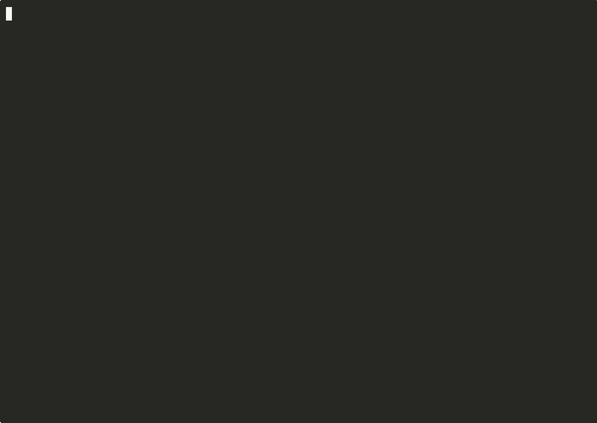
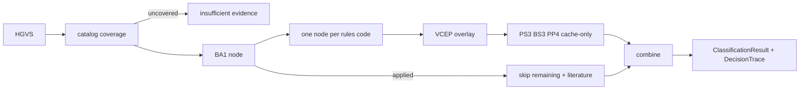

# acmg-triage

A LangGraph engine that takes an HGVS or VCF variant and returns an ACMG/AMP
2015 classification as a typed evidence trail, including explicit conflict and
insufficient-evidence refusals.

[](https://github.com/techiegoku2623/acmg-triage/actions/workflows/ci.yml)
[](pyproject.toml)
[](LICENSE)



## Status

| Phase | Deliverable | Status |
| --- | --- | --- |
| 0 | Research memo and harnesses | Phase 0 Merged |
| 1 | Architecture, schemas, data contracts | Phases 1–3 Merged |
| 2 | First vertical slice | Phases 1–3 Merged |
| 3 | Evaluation and demo | Phases 1–3 Merged |


## The problem this solves

Labs still classify variants of uncertain significance by walking the 28
ACMG/AMP 2015 evidence codes and combining them with a published table. Two
curators given the same variant often fire different codes, and the reason is
usually a cell in a spreadsheet. ClinVar stores the resulting label; it does
not store a replayable trail.

InterVar and lab-internal engines already automate the 2015 defaults. They
do not treat ClinGen gene-specific overlays as a diffable table, they do not
isolate literature codes behind a mocked LLM node, and they collapse
pathogenic-plus-benign evidence into Uncertain significance. That collapse is
the failure mode this repo refuses: conflict is a first-class output.

This is research / decision-support tooling. It is not a medical device, not
a diagnostic, and not clinical advice. Every response states that a licensed
molecular geneticist must review the trail. No patient-identifiable data is
used.

## Walkthrough

`make demo` is the full walkthrough: demo-plan, classify S1/S2/S3/S5, then
`make eval`. No credentials. No downloads. Under five minutes.

The video is generated from `demo/script/shots.yaml` — the same commands,
never a screen share. `make record` rebuilds every asset. The 100×30 shots
use `--summary` so output fits a phone-width frame; `--explain` is the
full trail below.

Regenerate: see `demo/README.md`.

### Step 1 — designed sample set

```bash
make setup && acmg demo-plan --dry-run
```

Actual stdout:

```
acmg-triage designed sample variants

S1-pathogenic-frameshift  NM_000059.4:c.5946del  BRCA2
  path:     clean pathogenic-leaning trail (PVS1 + PM2)
  expected: PVS1 and PM2 apply. Classification is Likely pathogenic under the
2015 table (1 very strong + 1 moderate). No conflict. High confidence.

S2-ba1-short-circuit  NM_000059.4:c.1114A>C  BRCA2
  path:     BA1 stand-alone short-circuit
  expected: BA1 applies. Remaining criteria are listed as skipped. No
literature-node LLM calls. Classification Benign.

S3-conflicting-vus  NM_000059.4:c.2311G>A  BRCA2
  path:     conflicting evidence, refuse to collapse
  expected: Output flags CONFLICTING EVIDENCE, lists both directions, does not
emit a single ACMG tier.

S4-clingen-pm2-override  NM_000257.4:c.1988G>A  MYH7
  path:     ClinGen gene-specific PM2 threshold override
  expected: Report both the default call and the gene-specific override. Do not
silently pick one threshold.

S5-insufficient-evidence  NM_001005237.2:c.200A>G  OR8U1
  path:     insufficient evidence refusal
  expected: Return insufficient evidence. Do not emit an ACMG tier. Non-zero
confidence is a bug.


Research tool only. This output does not constitute clinical interpretation and
requires review by a licensed molecular geneticist.

Dry run only. Classification (`acmg classify`) is the next walkthrough step;
this command exists so `make demo` can show that the sample set is designed, not
sampled.
```

### Step 2 — clean pathogenic-leaning trail

```bash
acmg classify --hgvs "NM_000059.4:c.5946del" --explain
```


Actual stdout:

```
NM_000059.4:c.5946del  BRCA2
sample: S1-pathogenic-frameshift
classification: Likely pathogenic
matched rule: Likely pathogenic: very_strong>=1, moderate>=1
applied: PM2, PVS1
skipped: BA1, BP4, BP7, BS1, BS3, PM4, PP3, PP4, PS3

Evidence trail
┌ code ┬ applied ┬ strength    ┬ rationale                              ┐
│ PM2  │ yes     │ moderate    │ gnomAD AF 0 < default PM2 1e-05 (2015  │
│      │         │             │ moderate)                              │
│ PVS1 │ yes     │ very_strong │ frameshift in LOF gene.                │
└──────┴─────────┴─────────────┴────────────────────────────────────────┘

VCEP overlay (default vs gene-specific)
default classification: Likely pathogenic  |  overlay classification: Uncertain
significance
│ PM2  │ True/moderate │ True/supporting │ VCEP PM2 requires absence from
gnomAD; AF 0

cost: $0.0000 (cache-only)

Research tool only. This output does not constitute clinical interpretation and
requires review by a licensed molecular geneticist.
```

The evidence trail is the product, not the label. Default 2015 is Likely
pathogenic (PVS1 + PM2 moderate). The ENIGMA overlay reports PM2 as
supporting and would be Uncertain significance. Both are printed.

### Step 3 — BA1 short-circuit

```bash
acmg classify --hgvs "NM_000059.4:c.1114A>C" --explain
```


Actual stdout:

```
NM_000059.4:c.1114A>C  BRCA2
sample: S2-ba1-short-circuit
classification: Benign
matched rule: BA1 stand-alone short-circuit
BA1 stand-alone short-circuit. Remaining criteria listed as skipped.
applied: BA1
skipped: BP4, BP7, BS1, BS3, PM2, PM4, PP3, PP4, PS3, PVS1

  BA1      on    gnomAD AF 0.27 >= default BA1 0.05
  PVS1     skip  Skipped after BA1 stand-alone short-circuit.
  PS3      skip  Skipped after BA1 stand-alone short-circuit. No literature-node
call.

cost: $0.0000 (cache-only)

Research tool only. This output does not constitute clinical interpretation and
requires review by a licensed molecular geneticist.
```

### Step 4 — conflict

```bash
acmg classify --hgvs "NM_000059.4:c.2311G>A" --explain
```


Actual stdout:

```
NM_000059.4:c.2311G>A  BRCA2
sample: S3-conflicting-vus
CONFLICTING EVIDENCE
Both pathogenic-leaning and benign-leaning codes applied. No single ACMG tier is
emitted.
classification: Conflicting
applied: PM2, BP4
skipped: BA1, BP7, BS1, BS3, PM4, PP3, PP4, PS3, PVS1

Research tool only. This output does not constitute clinical interpretation and
requires review by a licensed molecular geneticist.
```

### Step 5 — refusal, then the measured baseline

```bash
acmg classify --hgvs "NM_001005237.2:c.200A>G"
make eval
```


Actual classify stdout:

```
NM_001005237.2:c.200A>G  OR8U1
sample: S5-insufficient-evidence
INSUFFICIENT EVIDENCE
No catalog coverage. No ACMG tier is emitted. Confidence is 0. This is a
refusal, not a guess.
confidence: 0.0
applied: (none)

cost: $0.0000 (cache-only)

Research tool only. This output does not constitute clinical interpretation and
requires review by a licensed molecular geneticist.
```

`make eval` regenerates `docs/EVALUATION.md` from the Phase 0 harnesses plus
the Phase 3 table. The rules-only baseline column is mandatory.


[Full demo video (mp4)](demo/out/acmg-triage-demo.mp4) — title, problem,
shots, conflict refusal, eval table. Selectable captions live in
`demo/script/captions/`.

## Layout

Read in this order:

1. `docs/phase-0/research-memo.md` — why the defaults and the failure condition
2. `data/sample/README.md` — why each demo variant exists
3. `src/acmg_triage/combining.py` — the declarative 2015 table
4. `src/acmg_triage/rules.py` — default computational codes
5. `src/acmg_triage/graph.py` — thin typed graph (one node per rules code)
6. `research/phase0/` — the three measurements behind the memo
7. `research/phase3/` — rules-only vs frequency-only vs full system
8. `src/acmg_triage/cli.py` — demo-plan, classify, batch

## Results

Regenerated by `make eval`. Baseline column is mandatory.

<!-- EVAL_TABLE_BEGIN -->

| System | Concordance | n | Notes |
| --- | --- | --- | --- |
| Rules-only baseline (Phase 0) | 0.670 | 100 | Default 2015 computational codes + combining table |
| Frequency-threshold-only | 0.770 | 100 | BA1/BS1/PM2 only |
| Full system (LLM on) | 0.670 | 100 | Typed graph; literature cache-only |
| Full system (LLM off) | 0.670 | 100 | Must equal rules-only |

Default-only codes that cleared F1≥0.90 with no strength mismatch: BP4. Codes blocked on a VCEP overlay: PVS1, PM2, PP3, BA1, BS1.

<!-- EVAL_TABLE_END -->

## 🏗️ Architecture & Event Topology



`EvidenceCall` is the data that moves. `CombiningResult.classification` is
`Conflicting` when both directions fired. BA1 replaces the rest of the list
with a skip set. Literature nodes read `data/sample/literature_cache.json`
only. Cost is always 0. Optional `POST /classify` is not required by the demo.

## ⚖️ Architecture Trade-offs & Pragmatic Decisions

| Chosen | Given up | What would change the answer |
| --- | --- | --- |
| Richards 2015 table as declarative rows | Tavtigian Bayesian points | A Phase 3 eval where points beat the table on expert-panel concordance |
| Default 2015 computational rules as the emitted tier | Silently replacing them with VCEP | Overlay is printed; S1 default is LP and overlay is VUS |
| Committed probe set instead of erepo dump | Live ClinGen gold | DUA-free demo; replace the 100 before claiming a headline rate |
| Committed literature cache | Live PS3/BS3/PP4 API | Keys are forbidden in the demo path; cost is always 0 |
| Conflict as its own tier | Collapsing to VUS | The spec forbids silent collapse |

## 🛡️ Edge Cases & Failure Modes

- Last-exon frameshifts: default PVS1 stays very_strong; VCEP gold caps it.
- AF in `(0, 1e-5)`: default PM2 fires; ENIGMA-style absent-only gold does not.
- PM2 at supporting strength plus PVS1 is Uncertain significance, not LP.
- A gene with no catalog coverage can still fire PM2. S5 refuses on coverage
  (OR8U1 missing from `data/sample/catalog.json`), not on "no codes."
- PP5/BP6 are in the 28-code list and tagged catalog/deprecated. They are
  not implemented as rules.
- Live gnomAD / VEP / dbNSFP values are not fetched. Committed stand-ins
  will drift from today's databases.

## Limitations

This is not a clinical interpreter. It does not replace a molecular
geneticist. Output requires review by a licensed molecular geneticist.
The engine classifies designed probe records and committed sample features,
not live patient variants. Literature nodes never call an API. Expert-panel
hold-out concordance is still unmeasured.

## License and citation

MIT. Cite Richards et al., Genet Med 2015;17:405-424 for the criteria, the
ClinGen ENIGMA BRCA1/2 VCEP specification v1.2.0 (cspec GN097) for the
frequency cutoffs used in gold labels, and this repository for the engine.
